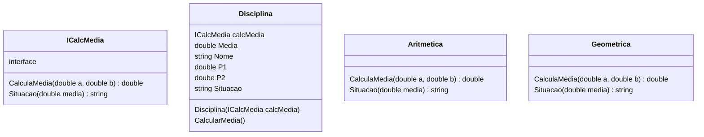

# Strategy Design Pattern

Exercício para a aula de Engenharia de Software III - FATEC Baixada Santista
Desenvolvido por: Igor Soares e Ana Paula Blascke

## Objetivo

> Usando seu conhecimento sobre o design pattern “Strategy” implemente duas classes concretas para o conjunto de classes abaixo.
> 
> Uma classe deve suportar média aritmética e considerar como aprovados os casos nos quais a média for superior a 5,0.
> A outra deve usar média geométrica e considerar como aprovados os casos em que a média for superior a 7,0.

### Classes

## Metodologia

Implementado utilizando o conceito de [interfaces em Go](https://gobyexample.com/interfaces).

## Executar

O tipo de cálculo a ser executado deverá ser passado como parâmetro para o programa.

Para executar o programa com **média aritmética**, rode o comando `go run main.go -a` na raiz do projeto.

Para executar o programa com **média geométrica**, rode o comando `go run main.go -g` na raiz do projeto.

Caso não tenha a linguagem Go instalada, poderá utilizar diretamente a versão compilada para linux, executando diretamente o binário `./main-linux-x86_64 -a` ou `./main-linux-x86_64 -g`.

